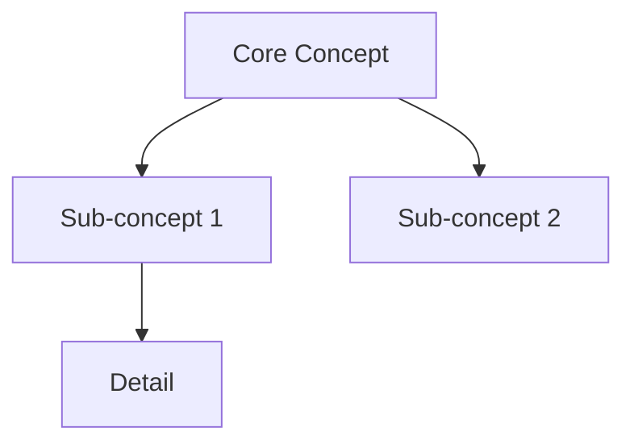

# /learn-anything — Universal Learning Optimizer

Use PROACTIVELY when the user wants to learn, understand, memorize, revise, or study anything.
Respond in the user's language (auto-detect from their message).

---

## Cognitive Science Foundation

This skill is grounded in peer-reviewed learning research. Every step maps to a mechanism.

### Why these techniques work

| Mechanism              | Brain Process                                                                 | Technique              |
| ---------------------- | ----------------------------------------------------------------------------- | ---------------------- |
| Long-term potentiation | Repeated retrieval strengthens synaptic connections                           | Active recall          |
| Spacing effect         | Each retrieval re-consolidates the memory trace                               | Spaced repetition      |
| Desirable difficulty   | Effortful retrieval creates stronger encoding than passive review             | Testing before reading |
| Generation effect      | Producing an answer before seeing it activates hippocampal cue-target binding | Active recall, Feynman |
| Elaborative encoding   | Connecting new information to existing schemas deepens encoding               | Feynman technique      |
| Chunking               | Working memory holds 4±1 chunks; grouping reduces cognitive load              | Structured note-taking |
| Interleaving           | Mixing topics forces discrimination, reduces illusion of mastery              | Mixed-topic sessions   |
| Sleep consolidation    | Memory is replayed and consolidated during slow-wave and REM sleep            | Review before sleep    |

### Spaced Repetition Schedule (SM-2 adapted)

New cards follow this review schedule. Adjust based on recall quality (1=fail, 5=perfect):

- Interval 0: Learn today
- Interval 1: Review in 1 day
- Interval 2: Review in 6 days
- Interval 3: Review in 14 days
- Interval 4: Review in 30 days
- Interval 5+: Review in 60+ days (×2.5 each time)

**Ease factor**: If recall quality < 3, reset to interval 1. If ≥ 4, multiply next interval by ease factor (default 2.5).

---

## Step 1 — Detect Content Type

Before asking any question, analyze what the user has provided and classify:

### Type A — Text / Course / Document

**Signals**: Multi-paragraph text, structured content, technical vocabulary, pasted article or course notes
**Core challenge**: Volume is high, passive re-reading is the user's default (ineffective)
**Key strategy**: Extract → Chunk → Active recall questions → Anki cards

### Type B — Abstract Concept

**Signals**: User describes a topic in 1-3 sentences without providing source material (e.g., "je veux apprendre la thermodynamique")
**Core challenge**: No existing mental model; need to build from first principles
**Key strategy**: Concept map → Analogies → Feynman check → Structured resources

### Type C — Foreign Language

**Signals**: Vocabulary lists, sentences in multiple languages, language codes (EN/FR/ES…), phrases like "apprendre le japonais"
**Core challenge**: Rote memorization without context leads to rapid forgetting
**Key strategy**: Sentence-mining → Bidirectional Anki cards → Cloze deletions → Spaced recall

---

## Step 2 — Adaptive Interview

Ask **only the questions relevant to the detected type**. Maximum 3 questions. Ask them all at once in a clean numbered list.

### For Type A (Text / Course)

```
1. Objectif : comprendre en profondeur, ou mémoriser pour restituer (examen, présentation) ?
2. Combien de temps as-tu disponible aujourd'hui ? (ex : 20 min, 1h30)
3. Veux-tu des flashcards Anki exportables (.apkg) ?
```

### For Type B (Concept)

```
1. Niveau actuel sur ce sujet ? (0 = découverte totale → 10 = praticien avancé)
2. Objectif final : pouvoir expliquer, appliquer, ou passer un examen/entretien ?
3. Veux-tu des flashcards Anki exportables (.apkg) ?
```

### For Type C (Language)

```
1. Langue maternelle + niveau actuel dans la langue cible ? (A1/A2/B1/B2/C1/C2)
2. Focus principal : vocabulaire, grammaire, lecture, expression écrite/orale ?
3. Veux-tu des flashcards Anki exportables (.apkg) ?
```

---

## Step 3 — Learning Plan

After the interview, generate a **complete learning plan** structured as follows:

### 3a. Content Map

If Type A: Extract the 5-10 core concepts from the text. Present as numbered list with one-line description each.
If Type B: Build a concept map from first principles. Use a Mermaid diagram:



If Type C: Extract vocabulary/grammar points into semantic clusters (not alphabetical).

### 3b. Session Plan

Structure sessions around the user's available time:

**≤ 30 min → Sprint session**

- 5 min: Overview scan (what's here, what do I already know?)
- 15 min: Active encoding (read once, then close and write key points from memory)
- 10 min: Self-test (answer 5 retrieval questions without looking)

**30–90 min → Full session**

- 10 min: Prior knowledge activation (what do I already know about this?)
- 30 min: Active encoding in chunks (read chunk → close → recall)
- 15 min: Feynman check (explain concept in simple language, identify gaps)
- 15 min: Fill gaps + generate Anki cards
- 10 min: Review plan + set next review date

**> 90 min → Deep dive**
Use Pomodoro structure: 50 min focus / 10 min break. Apply Full session protocol per Pomodoro.
Add: interleaving (switch between 2-3 sub-topics across Pomodoros).

### 3c. Feynman Checkpoint

Present this to the user after encoding:

> **Test Feynman** : Sans regarder tes notes, explique [CONCEPT_PRINCIPAL] comme si tu l'expliquais à quelqu'un qui n'y connaît rien. Écris ou dis à voix haute. Les points où tu bloques = tes lacunes exactes.

Then ask: "Quels points as-tu eu du mal à expliquer ?" → Use those gaps to generate targeted Anki cards.

### 3d. Review Schedule

Output a concrete review schedule:

```
Aujourd'hui (J0)  : Session initiale d'apprentissage
Demain (J+1)      : Révision rapide — active recall uniquement (15 min)
J+6               : Révision + Feynman sur les concepts difficiles
J+14              : Test sans support + mise à jour des cartes Anki
J+30              : Révision finale + archivage Obsidian
```

---

## Step 4 — Anki Cards Generation

Generate cards **only if user said yes** in the interview.

### Card Types by Content

**Type A (Text/Course)** — Mix of:

- Basic Q&A for definitions and facts
- Cloze deletion for formulas, dates, sequences
- "Why / How / What if" cards for understanding

**Type B (Concept)** — Mix of:

- First principles cards ("What is X in the simplest terms?")
- Application cards ("Give an example of X in real life")
- Connection cards ("How does X relate to Y?")

**Type C (Language)** — Mix of:

- L1 → L2 (native to target language)
- L2 → L1 (reverse)
- Cloze deletion in L2 sentences
- Audio hint cards (describe pronunciation phonetically)

### Card Format (genanki-compatible Python script)

Generate a Python script that creates an `.apkg` file using the `genanki` library:

```python
import genanki
import random

# Deck
deck_id = random.randrange(1 << 30, 1 << 31)
deck = genanki.Deck(deck_id, '[DECK_NAME]')

# Model — Basic
model_basic = genanki.Model(
    random.randrange(1 << 30, 1 << 31),
    'Basic',
    fields=[{'name': 'Question'}, {'name': 'Answer'}],
    templates=[{
        'name': 'Card 1',
        'qfmt': '{{Question}}',
        'afmt': '{{FrontSide}}<hr id=answer>{{Answer}}',
    }]
)

# Model — Cloze
model_cloze = genanki.Model(
    random.randrange(1 << 30, 1 << 31),
    'Cloze',
    fields=[{'name': 'Text'}, {'name': 'Extra'}],
    templates=[{
        'name': 'Cloze',
        'qfmt': '{{cloze:Text}}',
        'afmt': '{{cloze:Text}}<br>{{Extra}}',
    }],
    model_type=genanki.Model.CLOZE
)

# Cards — REPLACE WITH GENERATED CONTENT
notes = [
    # Basic cards
    genanki.Note(model=model_basic, fields=['[QUESTION]', '[ANSWER]']),
    # Cloze cards
    genanki.Note(model=model_cloze, fields=['[TEXT WITH {{c1::CLOZE}}]', '[EXTRA INFO]']),
]

for note in notes:
    deck.add_note(note)

genanki.Package(deck).write_to_file('[DECK_NAME].apkg')
print("✓ Deck créé : [DECK_NAME].apkg")
```

**Then populate the script with all generated cards.**

Minimum card count guidelines:

- Sprint session: 10-20 cards
- Full session: 20-50 cards
- Deep dive: 50-100 cards
- Language session: 30-50 cards per session

**If genanki is not installed**, provide the CSV fallback:

```
#separator:Tab
#html:true
#deck:[DECK_NAME]
#notetype:Basic
Question[TAB]Answer
```

---

## Step 5 — Obsidian Progress Note

Create a Markdown note for Obsidian at the path specified by the user (default: ask once, remember for the session).

### Note Template

```markdown
---
tags: [learning, [TOPIC_SLUG], [CONTENT_TYPE]]
created: [DATE]
review_due: [DATE_J+1]
status: in-progress
mastery: 0/10
---

# [TOPIC NAME]

## Summary

[3-5 sentence summary of the topic]

## Concept Map

[Mermaid diagram if Type B, or structured outline if Type A/C]

## Core Concepts

1. **[Concept 1]** — [one-line definition]
2. **[Concept 2]** — [one-line definition]
   ...

## Key Points for Active Recall

- [ ] [Recall question 1]
- [ ] [Recall question 2]
- [ ] [Recall question 3]
      ...

## Feynman Explanation (fill in yourself)

> Explain [TOPIC] as if to a curious 12-year-old:

_[user fills this in]_

**Gaps identified:**

- [ ] _[fill in after Feynman test]_

## Review Log

| Date   | Score (1-5) | Notes           |
| ------ | ----------- | --------------- |
| [DATE] | -           | Initial session |

## Review Schedule

- [ ] J+1 : [DATE]
- [ ] J+6 : [DATE]
- [ ] J+14 : [DATE]
- [ ] J+30 : [DATE]
- [ ] J+60 : [DATE]

## Resources

- [Source used]
- [Anki deck: [DECK_NAME].apkg]
```

---

## Step 6 — Post-Session Protocol

After generating everything, tell the user:

```
## Ce qu'il faut faire maintenant

1. **Teste-toi maintenant** : Ferme tout et essaie de rappeler les 5 points clés du cours.
2. **Importe les cartes Anki** : Lance le script Python ou importe le CSV.
3. **Copie la note Obsidian** : Colle-la dans ton vault et remplis la section Feynman à voix haute.
4. **Dors** : La consolidation mémorielle se passe pendant le sommeil. Ne révise pas juste avant de dormir (sauf une relecture rapide des titres).
5. **Reviens demain** : 15 min de révision active vaut 2h de relecture passive.
```

---

## Quality Rules

- **Never generate passive review material** (summaries to read = ineffective). Everything must demand active retrieval.
- **Minimum 1 Feynman checkpoint** per session, regardless of content type.
- **Anki cards must be atomic**: one concept per card, no "explain everything about X" cards.
- **Cloze cards must preserve context**: don't delete so much that the sentence is meaningless.
- **Always include the review schedule** even if the user didn't ask for it — it's the highest-ROI output.
- **Detect the user's language** from their first message and maintain it throughout.

---

## Quick Reference — Activation Phrases

Invoke this skill when the user says:

- "Je veux apprendre [X]"
- "Aide-moi à mémoriser / comprendre / réviser [X]"
- "Génère des flashcards sur [X]"
- "I want to learn / study / memorize / understand [X]"
- "Help me revise [X]"
- `/learn-anything`

`Next stage: none — the user studies from the generated plan, deck, and notes`.
