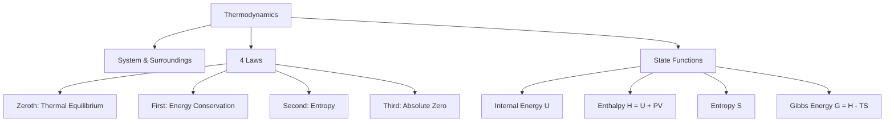

# Example Session — Physics: Thermodynamics (12-page course)

> Real session output. Material: a 12-page undergraduate thermodynamics chapter.

---

## Interview

```
Content detected: Type A — Text / Course (12 paragraphs, 4 equations, 2 diagrams)

Questions:
1. Goal: understand deeply or memorize for exam?  →  Understand deeply
2. Time available today?  →  1h30
3. Export Anki flashcards (.apkg)?  →  Yes
```

---

## Concept Map



---

## Session Plan (1h30 → 3 × 30 min Pomodoros)

### Pomodoro 1 — Encoding (30 min)
- 5 min: Scan all headings and figures. Note what you already know.
- 20 min: Read section by section. After each section, close and write 3 key points from memory.
- 5 min: Review your notes. Don't re-read the chapter.

### Pomodoro 2 — Active Recall (30 min)
- Answer these 8 questions WITHOUT looking at your notes:
  1. What distinguishes a state function from a path function?
  2. State the First Law in words and as an equation.
  3. Why does entropy always increase in an isolated system?
  4. What is the physical meaning of Gibbs free energy?
  5. What condition makes a process spontaneous at constant T and P?
  6. Explain the difference between isothermal and adiabatic processes.
  7. What does ΔH < 0 tell you about a reaction?
  8. Why is the Third Law useful for calculating absolute entropies?

### Pomodoro 3 — Feynman + Cards (30 min)
- 10 min: Feynman test (see below)
- 20 min: Generate and review Anki cards

---

## Feynman Checkpoint

> Explain entropy to a curious 12-year-old, without using the word "disorder."

**Example answer that reveals gaps:**
*"Entropy is like... how many ways you can arrange something. A hot coffee mug has fewer arrangements of energy than a cold coffee mug + warm room. Energy spreads out because there are more ways for it to be spread than concentrated. That's why heat flows from hot to cold — not because it has to, but because the spread-out state is overwhelmingly more likely."*

**Gaps detected in this explanation:**
- [ ] Relationship between entropy and statistical mechanics (Boltzmann: S = k ln W)
- [ ] Why ΔS > 0 for irreversible processes specifically
- [ ] How to calculate ΔS for phase transitions

→ These 3 gaps generated 6 targeted Anki cards.

---

## Anki Cards (34 total)

### Basic Cards (sample)

| Question | Answer |
|----------|--------|
| What is the First Law of Thermodynamics? | ΔU = q + w (energy is conserved; the change in internal energy equals heat added plus work done on the system) |
| Define a state function | A property whose value depends only on the current state of the system, not on the path taken to reach it. Examples: U, H, S, G |
| What does ΔG < 0 indicate? | The process is spontaneous at constant temperature and pressure |
| Physical meaning of entropy | A measure of the number of microstates (W) available to a system: S = k_B ln W |

### Cloze Cards (sample)

```
The {{c1::First}} Law states that energy is {{c2::conserved}}: ΔU = {{c3::q + w}}
```

```
Gibbs free energy: G = {{c1::H}} − {{c2::T}}{{c3::S}}. A reaction is spontaneous when ΔG is {{c4::negative}}.
```

### Generated Python script (run to create thermodynamics.apkg)

```python
import genanki, random

deck = genanki.Deck(random.randrange(1<<30,1<<31), 'Thermodynamics')
model_basic = genanki.Model(random.randrange(1<<30,1<<31), 'Basic',
    fields=[{'name':'Question'},{'name':'Answer'}],
    templates=[{'name':'Card 1','qfmt':'{{Question}}','afmt':'{{FrontSide}}<hr>{{Answer}}'}])

notes = [
    ('What is the First Law of Thermodynamics?',
     'ΔU = q + w — energy is conserved'),
    ('Define a state function',
     'Property depending only on current state, not path. Examples: U, H, S, G'),
    ('What does ΔG < 0 indicate?',
     'Process is spontaneous at constant T and P'),
    # ... (34 cards total in generated output)
]

for q, a in notes:
    deck.add_note(genanki.Note(model=model_basic, fields=[q, a]))

genanki.Package(deck).write_to_file('thermodynamics.apkg')
print('✓ thermodynamics.apkg created')
```

---

## Obsidian Note

```markdown
---
tags: [learning, thermodynamics, physics, university]
created: 2026-06-10
review_due: 2026-06-11
status: in-progress
mastery: 3/10
---

# Thermodynamics

## Summary
Thermodynamics describes energy transformations in systems. The four laws define
the boundaries of what's possible: energy conservation (1st), entropy increase (2nd),
and the unreachability of absolute zero (3rd). State functions like H, S, and G
predict spontaneity and equilibrium.

## Review Schedule
- [x] J+0 : 2026-06-10 — Initial session
- [ ] J+1 : 2026-06-11 — Active recall (15 min)
- [ ] J+6 : 2026-06-16 — Feynman retest
- [ ] J+14 : 2026-06-24 — Full review
- [ ] J+30 : 2026-07-10 — Maintenance
```

---

## Post-Session

```
What to do now:
1. Self-test: close everything, recall 5 key points
2. Import thermodynamics.apkg into Anki
3. Paste the Obsidian note into your vault, fill in the Feynman section
4. Don't cram before sleep — a 5-minute title scan is enough
5. Come back tomorrow: 15 min active recall beats 2h of re-reading
```
