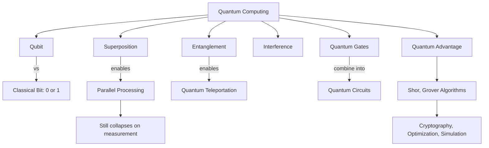

# Example Session — Quantum Computing (abstract concept)

> Real session output. User: "I want to understand quantum computing — I'm a developer with no physics background."

---

## Interview

```
Content detected: Type B — Abstract Concept

Questions:
1. Current level on this topic? (0=beginner, 10=expert)  →  2 (know what classical bits are)
2. End goal: explain it, apply it, or pass an interview?  →  Be able to explain it clearly + understand the hype
3. Export Anki flashcards?  →  Yes
```

---

## Concept Map



---

## Session Plan (2h available → full session)

### Phase 1 — Prior Knowledge Activation (10 min)
Answer these before reading anything:
- What is a classical bit? How does it differ from a qubit? (guess)
- Why would "parallelism" at the quantum level be useful?
- What does "entanglement" mean in everyday language?

*Don't look anything up. Write your answers down. These become your Feynman baseline.*

### Phase 2 — Structured Encoding (60 min)

**Concept 1 — Qubit (10 min)**
A qubit is not "0 and 1 at the same time." It's a probability distribution over 0 and 1. Measurement collapses it. Key analogy: a coin spinning in the air is "heads AND tails" until it lands.

**Concept 2 — Superposition (10 min)**
A qubit in superposition can be any linear combination: α|0⟩ + β|1⟩, where |α|² + |β|² = 1. The Born rule: measurement gives 0 with probability |α|², 1 with probability |β|².

**Concept 3 — Entanglement (10 min)**
Two qubits are entangled when their states can't be described independently. Measuring one instantly determines the other — no matter the distance. Not faster-than-light communication: you still need a classical channel to interpret the result.

**Concept 4 — Quantum Gates (10 min)**
Like logic gates (AND, OR, NOT) but unitary (reversible). Key gates: Hadamard (creates superposition), CNOT (creates entanglement), Pauli-X (quantum NOT).

**Concept 5 — Quantum Advantage (10 min)**
QC doesn't beat classical computing everywhere. It wins on specific problem types: integer factoring (Shor's algorithm, O(log³N) vs classical O(e^(N^1/3))), unstructured search (Grover's, O(√N) vs O(N)).

**Concept 6 — Current Limitations (10 min)**
Decoherence: qubits lose quantum state extremely fast (microseconds). Error correction requires thousands of physical qubits per logical qubit. Quantum supremacy ≠ quantum utility yet.

### Phase 3 — Feynman Test (20 min)
*Explain quantum computing to a smart 15-year-old who knows what a computer is.*

**Target explanation:**
> "Classical computers use bits — switches that are either off or on, 0 or 1. Quantum computers use qubits, which exploit quantum mechanics to exist in a combination of 0 and 1 until measured. This isn't magic parallelism — it's more like running a very clever probability game where the laws of physics let you amplify the right answers and cancel out the wrong ones. For certain problems, like breaking encryption or simulating molecules, this is astronomically faster. For most everyday tasks, your laptop is still better."

**Gaps revealed:**
- [ ] Why does superposition help with computation, specifically?
- [ ] What is quantum interference and why does it matter for algorithms?
- [ ] What does "quantum error correction" actually look like?

→ These 3 gaps → 9 targeted Anki cards added.

### Phase 4 — Anki Cards (20 min review)

---

## Anki Cards (28 total)

### Sample cards

| Question | Answer |
|----------|--------|
| What is a qubit? | A quantum bit — a two-level quantum system described by α\|0⟩ + β\|1⟩ where measurement gives 0 with prob \|α\|², 1 with prob \|β\|² |
| Why isn't entanglement faster-than-light communication? | Measurement outcomes are random; you need a classical channel to compare results and extract information |
| What is quantum decoherence? | The loss of quantum superposition due to interaction with the environment; the main practical obstacle to useful quantum computers |
| What problem does Shor's algorithm solve faster? | Integer factoring — O(log³N) quantum vs sub-exponential classical; threatens RSA encryption |
| What is the Hadamard gate? | A quantum gate that puts a qubit into equal superposition: H\|0⟩ = (\|0⟩ + \|1⟩)/√2 |
| What is quantum advantage? | When a quantum algorithm solves a problem significantly faster than the best known classical algorithm |

---

## Obsidian Note

```markdown
---
tags: [learning, quantum-computing, computer-science, physics]
created: 2026-06-10
review_due: 2026-06-11
status: in-progress
mastery: 2/10
---

# Quantum Computing

## One-Sentence Summary
Quantum computers use qubits in superposition and entanglement to run algorithms
that exploit quantum interference — amplifying right answers, canceling wrong ones —
giving exponential speedups for specific problems like factoring and search.

## Feynman Explanation (my version)
_[fill in after session]_

## Gaps to Fill
- [ ] Why superposition helps computation specifically
- [ ] Quantum interference in algorithms
- [ ] Quantum error correction basics

## Review Schedule
- [ ] J+1 : 2026-06-11 — active recall only (15 min)
- [ ] J+6 : 2026-06-16 — Feynman retest
- [ ] J+14 : 2026-06-24 — full concept map from memory
- [ ] J+30 : 2026-07-10 — maintenance
```
