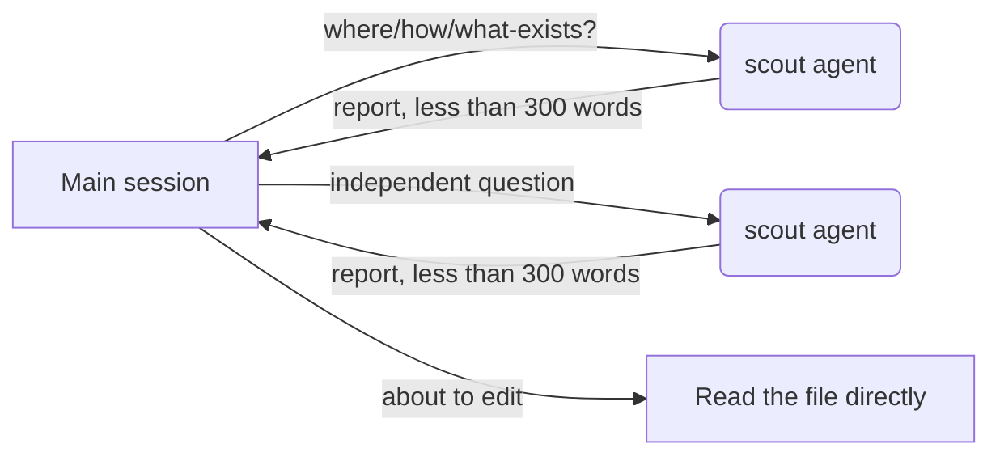
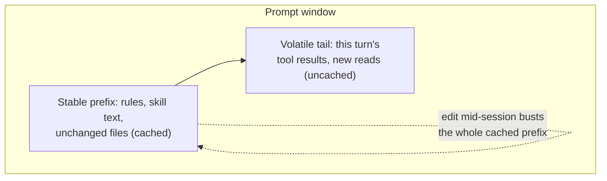

# Context management

Why the toolkit is so insistent about *not* reading files into the main
conversation, and where each mitigation actually pays for itself.

## The problem: context rot, not just context limits

A model's ability to use what's in its context degrades well before the
window fills — "context rot" — so the goal isn't squeezing in one more
token, it's keeping the main conversation lean enough that every token in
it still earns attention. Relaunching a fresh session at a natural
boundary (task done, not "context full") beats compacting a
degraded one back into usefulness. See
[docs/context-management-research-2026-07.md](../context-management-research-2026-07.md)
("context rot", "three-layer framework") and, for the underlying research,
Anthropic's
[Effective context engineering for AI agents](https://www.anthropic.com/engineering/effective-context-engineering-for-ai-agents)
and
[Effective harnesses for long-running agents](https://www.anthropic.com/engineering/effective-harnesses-for-long-running-agents).

## The scout/delegate flow

The default move for any "where is X" / "how does Y work" / "what
exists" question is to fan the question out to a `scout` — a cheap,
read-only subagent whose entire transcript is thrown away once it
reports back. The caller keeps the conclusion, not the file dump.

Two things make this pay off rather than just adding hops:
- **Only the report re-enters the main window.** A scout can grep, `git
  log`, and read a dozen files; none of that transcript is ever paid for
  by the caller.
- **Fan-out is parallel, not serial.** Independent questions go out in
  one batch of scout calls rather than one after another, so the wall-clock
  cost doesn't scale with the number of questions the way the token cost
  would if they were read inline.

Reading a file directly is reserved for the moment you're actually about
to edit it — and even then, the relevant slice, not the whole file.

## Cache-window economics

Prompt caching only pays off when the cached prefix is stable: caches are
keyed on exact content, so anything that reorders or rewrites the front
of the prompt (editing CLAUDE.md or `.claude/rules/` mid-session, adding
or removing an MCP server, changing an agent's tool list mid-run) busts
the cache for every subsequent turn. That's why `/distill`-style edits to
always-loaded instructions are batched at session end rather than made
piecemeal while a session is in flight.

## Handoff artifacts and session hygiene

Long-running work is resumable from artifacts on disk — specs, task
files, notes in `docs/` — never from conversation memory. When a session
is getting heavy mid-task, `/handoff` writes a self-contained handoff
file (state, next action, pointers to evidence) so the next session can
pick up cold rather than needing the outgoing conversation replayed.
`/distill` is the complementary end-of-task step: it captures this
session's corrections, surprises, and repeated procedures into CLAUDE.md,
a rule, or a new skill, so the next session doesn't re-pay for the same
lesson.

## Skills and rules this page explains

- `.claude/agents/scout.md` — the scout agent (scout-tier, read-only,
  hard tool-call ceiling, capped report length).
- `.claude/skills/handoff/SKILL.md` — writes the resumable handoff
  artifact for a mid-task session break.
- `.claude/skills/distill/SKILL.md` — end-of-session capture of lessons
  into CLAUDE.md / rules / new skills.
- `.claude/rules/token-discipline.md` — "Delegation defaults", "Session
  hygiene", and "Cache economics" sections state the rules this page
  walks through.

## Further reading

- [docs/context-management-research-2026-07.md](../context-management-research-2026-07.md)
  — the full research synthesis this page draws from.
- [docs/anthropic-playbook.md](../anthropic-playbook.md) — "Token-cost
  doctrine" for the broader cost model.
