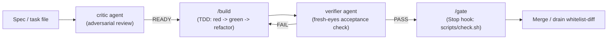

# Correctness

How the toolkit gets confidence that a change is actually right — not
"looks done" — without a human re-reading every diff.

## The pipeline: spec → critic → build → verifier → gate

Correctness is layered rather than pinned on any single check. Each stage
catches a different failure mode, and each is cheaper than the one it
guards against fixing after the fact.

- **critic** attacks the spec or plan *before* implementation starts —
  ambiguity, hidden dependencies, verification gaps, scope traps — because
  a critic pass costs a fraction of a percent of what a wrong
  implementation costs to unwind.
- **/build** is the TDD inner loop: write the failing test first, confirm
  it fails for the right reason, then implement to green without touching
  the test.
- **verifier** runs after implementation with no memory of it, so it
  can't rationalize a shortcut the way the implementer might; it checks
  the working tree against the task's own written acceptance criteria.
- **/gate** is the deterministic backstop: a Stop hook that blocks "done"
  until the repo's own `scripts/check.sh` (lint, typecheck, tests) is
  green, plus auto-format on edit and protected-file rules.

This mirrors Anthropic's own multi-stage code review approach — parallel
finder passes over different diff dimensions, independent verification of
findings, and severity ranking rather than a single flat pass. See
[Code Review](https://claude.com/blog/code-review) and its
[docs](https://code.claude.com/docs/en/code-review).

## Drain's whitelist-diff

When a task is drained (executed by an unattended worker and merged by an
orchestrator), the final safety check before merge is a whitelist diff:
`git diff $(git merge-base <default-branch> <branch>)..<branch> --
'*/tasks/*.md'` must show changes ONLY in the worker's own task file, and
only in the allowed fields — its `Status:` line, ticked checkboxes,
one-line evidence citations, and its plan comment block. Any edit outside
that shape — another task's file touched, a Goal or acceptance criterion
reworded — is treated as a post-verification edit and fails the merge.
This is what keeps many workers running unattended in parallel without
one worker's session quietly rewriting another's task.

## Bounding the review loop

Verification loops are bounded, not open-ended: after two failed
fix-and-reverify attempts on the same issue, the right move is to stop and
report rather than keep thrashing in a context that's already degraded —
a fresh session with a clearer task file beats a long one grinding on the
same failure. This is the same discipline the research doc states for
evaluator-optimizer loops generally: bound cycles, and prefer a single
rubric judge over multi-round voting except where voting is specifically
warranted (e.g. security-relevant review). See
[docs/orchestration-research-2026-07.md](../orchestration-research-2026-07.md)
("verification layers", "effort-scaling rules").

## Skills and agents this page explains

- `.claude/agents/critic.md` — adversarial reviewer for specs, plans, and
  diffs, run before implementation and before committing nontrivial
  changes.
- `.claude/agents/verifier.md` — independent, fresh-eyes acceptance
  verification after implementation.
- `.claude/skills/gate/SKILL.md` — installs the deterministic Stop-hook
  gate and pre-commit checks.
- `.claude/skills/drain/SKILL.md` — the whitelist-diff check described
  above, run before a drained task's branch is merged.

## Further reading

- [docs/orchestration-research-2026-07.md](../orchestration-research-2026-07.md)
  — "verification layers" section this page synthesizes.
- [docs/anthropic-playbook.md](../anthropic-playbook.md) — "Verification-first
  / TDD" and "How they keep quality up".
