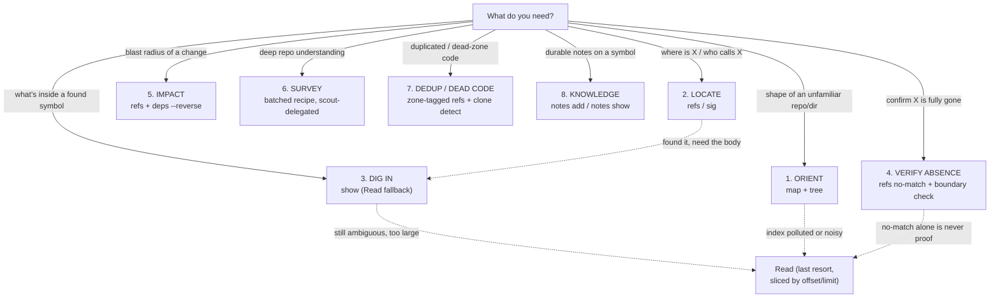

# ctx critical user journeys (CUJs)

The canonical playbook for what `ctx` is _for_. Eight journeys, each with a
trigger, the query sequence that serves it, the token shape to expect, and
its known failure modes (each citing the spec that owns the fix). The ctx
skill and the ctx spec family cite these CUJs by name instead of
re-describing usage. Doctrine for agents, not an end-user tutorial.

The payoff every CUJ chases is the structure-index economy: answering from
the index costs ~10x fewer tokens and ~2x fewer tool calls than reading
files (Codebase-Memory, arXiv 2603.27277). A journey "fails" when it forces
a fallback to whole-file reads, so each failure-mode list names what pushes
it there.

Every CUJ that still routes to a raw `Read` fallback in the diagram is a
signal the index coverage or output shape hasn't shipped yet (see the Gap
table) — the goal is for `Read` to appear only for "about to edit," never
as a stand-in for a query ctx should answer directly.

## 1. ORIENT — "what is this codebase/module?"

- **Trigger:** first contact with an unfamiliar repo or top-level dir; you
  need the shape before any specific question.
- **Sequence:** `ctx map --tokens N` for the whole-repo ranked digest, then
  `ctx tree <path>` per top-level dir of interest. `map` has NO `--limit`
  flag — its budget knob is `--tokens` (plus `--doc`/`--json`).
- **Token shape:** one bounded digest sized to the `--tokens` budget
  (default ~1000), then a handful of small per-dir trees — never a file dump.
- **Failure modes:** index pollution from minified/vendored code inflating
  the map (specs/ctx-minified-skip; the git-tracked-file overlay,
  specs/ctxignore-git-overlay); ranking noise burying the real entry points
  (specs/codebase-context-tree tasks/16).

## 2. LOCATE — "where is X / who calls X?"

- **Trigger:** you have a symbol name and need its definition site or its
  callers.
- **Sequence:** `ctx refs <name>` for references, `ctx sig <name>` for the
  definition + signature; on an ambiguous name, narrow with a file-scoped
  selector rather than eyeballing a long list
  (specs/ctx-query-ergonomics R1).
- **Token shape:** a ref list (one line per site, `[notes:N]`-tagged) or a
  single signature block — kilobytes, not the files themselves.
- **Failure modes:** heuristic misresolution — name-based matching picks the
  wrong same-named symbol, with no type-level precision until the LSP layer
  lands (specs/ctx-static-analysis-augmentation F1).

## 3. DIG IN — "what's inside it?"

- **Trigger:** you found the symbol and now need its body, not just its
  signature.
- **Sequence:** `ctx show <symbol>` to print exactly the symbol's span
  (specs/ctx-query-ergonomics R2); fall back to `Read` only for the lines
  past that span you still need.
- **Token shape:** one symbol's source span — bounded by the definition, not
  the enclosing file.
- **Failure modes:** `show` is not yet shipped, so today this journey
  degrades to `ctx at <file>:<line>` + a span-scoped `Read`, which over-reads
  when the symbol is large (specs/ctx-query-ergonomics R2).

## 4. VERIFY ABSENCE — "is X gone?"

- **Trigger:** confirming a symbol was fully removed (post-refactor, dead-code
  cleanup, rename sweep).
- **Sequence:** `ctx refs <name>` — but a no-match is NEVER sufficient proof
  on its own; the journey wants a no-match that states the boundary it
  searched plus a suggested bounded content check
  (specs/ctx-absence-check).
- **Token shape:** a short boundary-stating no-match line plus a one-line
  follow-up suggestion — not silence.
- **Failure modes:** a bare empty result read as "gone" when the index
  simply did not cover the reference (the figureBboxes miss, 2026-07-20);
  the boundary-stating output is specced, not yet shipped
  (specs/ctx-absence-check).

## 5. IMPACT — "what breaks if I change X?"

- **Trigger:** scoping a change; you need the blast radius before editing.
- **Sequence:** `ctx refs <name>` for call sites plus `ctx deps <file>
--reverse` for the importers of the file — the two together bound the
  affected set.
- **Token shape:** a ref list + a reverse-dependency edge list — both
  bounded, both structural.
- **Failure modes:** name-based refs over- or under-count without type
  resolution; exact, type-aware `refs --exact` via the LSP layer is specced
  (specs/ctx-static-analysis-augmentation F1).

## 6. SURVEY — "understand the repo deeply"

- **Trigger:** you need a thorough mental model, not a single lookup —
  onboarding, architecture review, a big cross-cutting change.
- **Sequence:** a batched query recipe (map + targeted trees + key
  signatures) delegated to a cheap-tier scout, which returns a distilled
  digest instead of raw output (specs/ctx-skill-token-doctrine R4/R5).
- **Token shape:** one scout-distilled summary in the main context; the raw
  multi-query output stays in the scout's discarded transcript.
- **Failure modes:** running the batch inline blows the main context with
  raw output — the delegation recipe is the fix, and it is specced
  (specs/ctx-skill-token-doctrine R4/R5).

## 7. DEDUP / DEAD CODE — "what's duplicated; what's only alive in dead zones?"

- **Trigger:** cleanup and consolidation — finding clones to merge, or code
  referenced only from unreachable regions.
- **Sequence:** zone-tagged `ctx refs` to separate live from dead-zone
  references (specs/ctx-dead-code-zones), plus clone detection to surface
  near-duplicate spans (specs/ctx-static-analysis-augmentation F2).
- **Token shape:** a zone-annotated ref list and a clone-cluster report —
  structural, not full-file.
- **Failure modes:** blanket-excluding dead trees hides real signal —
  dead-code FINDS are the point (Steven directive, 2026-07-21); both the
  zone tagging (specs/ctx-dead-code-zones) and clone detection
  (specs/ctx-static-analysis-augmentation F2) are specced, not shipped.

## 8. KNOWLEDGE — "what do we know about this symbol?"

- **Trigger:** you want the durable, human-left context on a symbol — a
  gotcha, invariant, rationale, or todo — that survives refactors.
- **Sequence:** `ctx notes <symbol>` to read anchored notes, `ctx notes add
<symbol> "<text>" --kind ...` to leave one; `refs` output tags a def with
  `[notes:N]` when notes are anchored there.
- **Token shape:** a short note list per symbol — the smallest journey, pure
  durable-layer recall.
- **Failure modes:** notes anchored by symbol identity, so an aggressive
  rename can orphan them if the anchor is not re-resolved (the durable-layer
  concern this journey exists to serve).

## Gap table

| CUJ                  | Serving spec(s)                                                                                                        | Status                                                                                                                                           |
| -------------------- | ---------------------------------------------------------------------------------------------------------------------- | ------------------------------------------------------------------------------------------------------------------------------------------------ |
| 1. ORIENT            | map/tree in context-tree/src/cli.rs; specs/ctxignore-git-overlay; specs/ctx-minified-skip; specs/codebase-context-tree | shipped (context-tree/src/cli.rs; overlay context-tree/src/vcs/mod.rs) + specced (specs/ctx-minified-skip, specs/codebase-context-tree tasks/16) |
| 2. LOCATE            | refs/sig in context-tree/src/cli.rs; specs/ctx-query-ergonomics                                                        | shipped (context-tree/src/cli.rs) + specced (specs/ctx-query-ergonomics R1)                                                                      |
| 3. DIG IN            | specs/ctx-query-ergonomics                                                                                             | specced (specs/ctx-query-ergonomics R2 — `show` not yet shipped)                                                                                 |
| 4. VERIFY ABSENCE    | specs/ctx-absence-check                                                                                                | specced (specs/ctx-absence-check)                                                                                                                |
| 5. IMPACT            | refs/deps --reverse in context-tree/src/cli.rs; specs/ctx-static-analysis-augmentation                                 | shipped (context-tree/src/cli.rs) + specced (specs/ctx-static-analysis-augmentation F1)                                                          |
| 6. SURVEY            | specs/ctx-skill-token-doctrine                                                                                         | specced (specs/ctx-skill-token-doctrine R4/R5)                                                                                                   |
| 7. DEDUP / DEAD CODE | specs/ctx-dead-code-zones; specs/ctx-static-analysis-augmentation                                                      | specced (specs/ctx-dead-code-zones; specs/ctx-static-analysis-augmentation F2)                                                                   |
| 8. KNOWLEDGE         | notes in context-tree/src/cli.rs                                                                                       | shipped (context-tree/src/cli.rs; context-tree/src/notes)                                                                                        |
