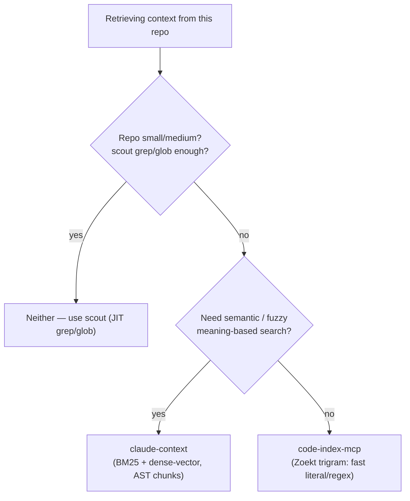

# Large-codebase context retrieval

How the toolkit retrieves context from large codebases — and when to reach
for an external code-search MCP server instead of building indexing tooling
here. The guiding decision is _document, don't build_: the mature prior art
already lives in public repos, so the win is integrating with the best fit,
not reinventing it.

Verified: 2026-07-11

## The retrieval landscape

### Anthropic: just-in-time retrieval, hybrid where latency matters

Anthropic's context-engineering guidance favors **just-in-time (JIT)
retrieval** — the agent holds lightweight identifiers (file paths, names,
links) and loads the actual content on demand at runtime — over loading a
heavy pre-computed index up front. It explicitly endorses a **hybrid**
(some upfront retrieval plus autonomous just-in-time exploration) where
latency matters and waiting for round after round of on-demand discovery
would be too slow.
[anthropic.com/engineering/effective-context-engineering-for-ai-agents](https://www.anthropic.com/engineering/effective-context-engineering-for-ai-agents)

This is why this toolkit's default retrieval move is a `scout` agent doing
grep/glob on demand, not a maintained index: JIT first, and reach for a
pre-built index only when JIT stops converging.

### Aider's repo-map: the reference design

Aider's **repo-map** is the best-documented reference design for a compact,
whole-repo view. It parses source with **tree-sitter**, ranks symbols with a
**PageRank-style** graph over reference/definition edges, and renders a
**signature-only view of roughly 1k tokens** — just the definitions that
matter, not the bodies. It is the canonical example of "some upfront
retrieval" done cheaply.
[aider.chat/2023/10/22/repomap.html](https://aider.chat/2023/10/22/repomap.html)

### The official MCP reference servers ship nothing for code search

The official Model Context Protocol reference-servers repository ships
**nothing for code search or indexing** — there is no first-party MCP server
to adopt for this. Any integration is therefore with a third-party,
user-installed server.
[github.com/modelcontextprotocol/servers](https://github.com/modelcontextprotocol/servers)

## The in-repo structural option: `ctx`

Since 2026-07, this toolkit ships its own **structural** index:
`context-tree/` (CLI `ctx`, plus `ctx mcp` for tool-based harnesses). It
answers where-is-X-defined / who-calls-X / what-does-this-import questions
from a tree-sitter symbol index and carries refactor-surviving notes — the
`/ctx` skill teaches agents when to reach for it. It complements rather
than replaces the servers below: `ctx` is exact and structural; they are
semantic/fuzzy content search. For a structure question, try `ctx` first —
it needs no external service.

## The two mature third-party MCP servers

Both are **optional, user-installed, external** MCP servers. This toolkit
never bundles, installs, configures, or depends on either — every skill and
agent here works identically whether or not one is connected. They are
candidates you (the user) install into your own MCP configuration when your
repo is big enough to warrant it.

### `claude-context` (zilliztech) — semantic / hybrid search

Hybrid **BM25 + dense-vector** search over **AST-chunked** code, with
**Merkle-tree incremental re-indexing** so only changed files are
re-embedded. Best when you need semantic/fuzzy retrieval ("where do we
handle retries?") across a large, frequently-changing repo.
[github.com/zilliztech/claude-context](https://github.com/zilliztech/claude-context)

Install (typical, via its README): add it to your MCP client config as an
npx-launched server, e.g. in `claude_desktop_config.json` /
`.mcp.json`:

```json
{
  "mcpServers": {
    "claude-context": {
      "command": "npx",
      "args": ["-y", "@zilliz/claude-context-mcp@latest"]
    }
  }
}
```

It needs an embedding provider (e.g. an OpenAI API key) and a vector store
(Zilliz Cloud / Milvus) configured via env vars — see the README for the
exact variables. Follow the upstream README as the source of truth.

### `code-index-mcp` (trondhindenes) — fast literal / regex search

Wraps Sourcegraph's **Zoekt trigram index** for fast **substring and regex**
search across a large tree. No semantic layer — it is a speed play for
literal lookups, not meaning-based ones.
[github.com/trondhindenes/code-index-mcp](https://github.com/trondhindenes/code-index-mcp)

Install (typical, via its README): add it as an MCP server pointed at your
repo path, e.g.:

```json
{
  "mcpServers": {
    "code-index": {
      "command": "code-index-mcp",
      "args": ["--path", "/path/to/your/repo"]
    }
  }
}
```

Zoekt builds and maintains the trigram index; follow the upstream README for
the exact binary/launch details and indexing flags.

## Decision table: which one, if any

| Your situation                                                                                                                        | Reach for        | Why                                                                                                             |
| ------------------------------------------------------------------------------------------------------------------------------------- | ---------------- | --------------------------------------------------------------------------------------------------------------- |
| Need **semantic / fuzzy** search across a **large, frequently-changing** repo (meaning-based "where do we do X", tolerant of renames) | `claude-context` | Hybrid BM25 + dense-vector + AST chunking; Merkle-tree incremental reindex keeps a moving repo current cheaply. |
| Need **fast literal / regex** search across a large tree, **no semantic layer** needed                                                | `code-index-mcp` | Zoekt trigram index gives fast substring/regex hits without the cost of embeddings.                             |
| Repo is **small / medium**, and `scout`'s grep/glob is already enough                                                                 | **neither**      | JIT grep/glob converges fine; an external index adds setup and drift for no gain. Start here.                   |

Default to the last row. Only climb to a server when repeated `scout`
rounds on a fuzzy or semantic query genuinely stop converging.

## Decision flow



## How this connects to the session's judgment

Choosing a server is the **orchestrating session's** call, one layer above
`scout` — `scout` itself cannot `ToolSearch` and its tool grant is
deliberately narrow (Read, Grep, Glob, a little `git`). When repeated scout
dispatches on a fuzzy/semantic query aren't converging and such a server
_happens to be connected_ this session, the session runs a `ToolSearch` to
discover it and prefers it over further scout rounds. That preference is
recorded as one advisory bullet in
[../../.claude/rules/token-discipline.md](../../.claude/rules/token-discipline.md)'s
"Delegation defaults" section — conditional on a server being connected,
never a hard dependency.

## Further reading

- [anthropic.com/engineering/effective-context-engineering-for-ai-agents](https://www.anthropic.com/engineering/effective-context-engineering-for-ai-agents)
  — JIT vs. hybrid retrieval.
- [aider.chat/2023/10/22/repomap.html](https://aider.chat/2023/10/22/repomap.html)
  — the repo-map reference design.
- [github.com/zilliztech/claude-context](https://github.com/zilliztech/claude-context)
  and
  [github.com/trondhindenes/code-index-mcp](https://github.com/trondhindenes/code-index-mcp)
  — the two servers' own READMEs (the install source of truth).
