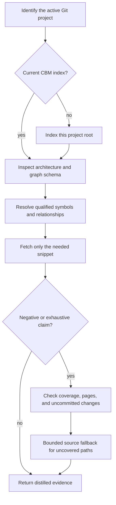

# Large-codebase exploration

Verified: 2026-07-26

The toolkit uses Codebase-Memory as its optional structural exploration
backend. The graph reduces repeated file reads, but it is never treated as
proof that unchecked source is absent.

## Retrieval order

1. Select the Codebase-Memory project whose canonical root matches the active
   Git repository. Index only that root when no project exists.
2. Use `get_architecture` for orientation.
3. Inspect `get_graph_schema` before writing a nontrivial graph query.
4. Resolve names to qualified symbols with `search_graph`.
5. Use `trace_path` from one resolved function for bounded caller/callee
   traversal, and use `detect_changes` for impact.
6. Fetch a body with `get_code_snippet` only after locating the symbol.
7. Use `search_code` for literal/content questions.

Keep pages small and distill results to qualified symbols, paths,
relationships, and coverage facts. The canonical
`codebase-memory` skill carries the complete query and negative-claim
contract.

```mermaid
flowchart TD
    A["Identify the active Git project"] --> B{"Current CBM index?"}
    B -->|no| C["Index this project root"]
    B -->|yes| D["Inspect architecture and graph schema"]
    C --> D
    D --> E["Resolve qualified symbols and relationships"]
    E --> F["Fetch only the needed snippet"]
    F --> G{"Negative or exhaustive claim?"}
    G -->|yes| H["Check coverage, pages, and uncommitted changes"]
    H --> I["Bounded source fallback for uncovered paths"]
    G -->|no| J["Return distilled evidence"]
    I --> J
```

## Coverage boundary

Before an exhaustive or negative claim, check project identity, index status,
pagination, ignored/skipped/unparsed paths, and uncommitted changes. A clean
graph result does not cover source the graph did not parse. Search those
candidate paths with bounded `rg` and small file reads.

If Codebase-Memory is unavailable, use that bounded fallback directly and say
that graph coverage was unavailable. A missing optional backend must not block
unrelated pipeline work.

## Runtime isolation

Install the pinned binary with `bin/install-codebase-memory`. The toolkit
launcher restricts each process to `CBM_ALLOWED_ROOT` and directs graph state
to `${XDG_CACHE_HOME:-$HOME/.cache}/agentic/codebase-memory`. Do not enable
the optional UI, automatic indexing of new repositories, or a graph artifact
inside the checkout.
