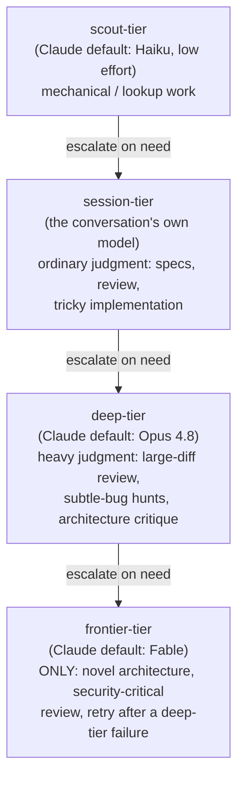

# Model routing

Why a skill spawning an agent has to say which model tier it wants,
rather than letting everything default to the session's own model.

## The four-rung tier ladder

`.claude/rules/token-discipline.md` defines four rungs, cheapest first —
the rule of thumb is: don't pay frontier-model rates to run `grep`.

Rungs are opt-in, not automatic: with no tier pin configured for a given
spawn point, the agent inherits the session model rather than silently
jumping to a deep tier.

## Where dispatch actually pins a tier

Skills that spawn agents consult `.claude/runtime.md` tier pins at their
actual spawn points and pass the mapped model through the harness's model
parameter — the same alias flows through both interactive Agent-tool
dispatch and the headless fallback templates' `--model` flag. Named spawn
points include:

- **drain's tournament workers and per-candidate verifier runs** — many
  candidates evaluated cheaply before the winner gets a deeper pass.
- **/design's candidate investigators** — parallel architecture
  explorations run at a cheaper tier than the final decision write-up.
- **on-demand verifier escalation** — a verifier's second pass on a
  finding it isn't confident about escalates rather than starting there.
- **the `scout` agent's own default** — every scout spawn is scout-tier
  by definition (Haiku, low effort, capped tool calls and report length),
  which is why "use a scout" is the toolkit's default answer to any
  where/how/what-exists question rather than reading files inline.

## Dispatch authoring: making the choice explicit

A skill that spawns agents has to state, in its own prompt text, the
tier, the return budget, and any loop bound — never let these default
silently. The concrete rules (tier by stage type, capped 1-2k token
returns, 2-4 cycle bounds on evaluator-optimizer loops, a single-call
rubric judge over multi-judge voting, and the deterministic-vs-model-driven
axis — script owns loops/fan-out/gates, model owns decomposition/routing)
live in `.claude/rules/token-discipline.md`'s "Dispatch authoring"
section, which in turn cites
[docs/anthropic-playbook.md](../anthropic-playbook.md) (Token-cost
doctrine) and
[docs/orchestration-research-2026-07.md](../orchestration-research-2026-07.md)
(the five workflow building blocks and effort-scaling rules) rather than
restating them.

The underlying research: Anthropic's canonical guidance puts control flow
(loops, fan-out, conditionals) in deterministic code and reserves
model-driven decisions for genuine flexibility, and treats multi-agent
setups as roughly an order of magnitude more expensive than a single
agent — so the tier and the fan-out width are both budget decisions, not
defaults. See
[Building effective agents](https://www.anthropic.com/research/building-effective-agents)
and
[Multi-agent research system](https://www.anthropic.com/engineering/multi-agent-research-system).

## Rules and skills this page explains

- `.claude/rules/token-discipline.md` — the tier ladder ("Model and
  effort matching") and the dispatch-authoring checklist that pins it at
  spawn points.
- `.claude/skills/drain/SKILL.md` — tournament workers and per-candidate
  verifier runs, one of the concrete tier-pin spawn points.
- `.claude/skills/design/SKILL.md` — candidate investigators, another
  concrete tier-pin spawn point.
- `.claude/agents/scout.md` — the scout-tier default agent.

## Further reading

- [docs/orchestration-research-2026-07.md](../orchestration-research-2026-07.md)
  — "token economics", "effort-scaling rules", the five workflow blocks.
- [docs/context-management-research-2026-07.md](../context-management-research-2026-07.md)
  — capped subagent returns as a context-cost control, not just a model
  one.
