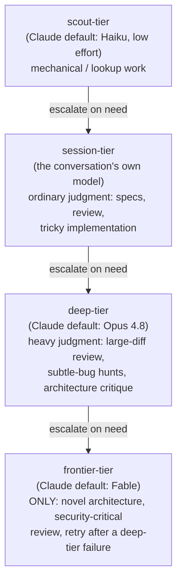

# Model routing

Why a skill spawning an agent has to say which model tier it wants,
rather than letting everything default to the session's own model.

## The four-rung tier ladder

`.claude/rules/token-discipline.md` defines four rungs, cheapest first —
the rule of thumb is: don't pay frontier-model rates to run `grep`.

Rungs are opt-in, not automatic: with no tier pin configured for a given
spawn point, the agent inherits the session model rather than silently
jumping to a deep tier.

## Where dispatch actually pins a tier

Skills that spawn agents consult `.claude/runtime.md` tier pins at their
actual spawn points and pass the mapped model through the harness's model
parameter — the same alias flows through both interactive Agent-tool
dispatch and the headless fallback templates' `--model` flag. Named spawn
points include:

- **drain's tournament workers and per-candidate verifier runs** — many
  candidates evaluated cheaply before the winner gets a deeper pass.
- **/design's candidate investigators** — parallel architecture
  explorations run at a cheaper tier than the final decision write-up.
- **on-demand verifier escalation** — a verifier's second pass on a
  finding it isn't confident about escalates rather than starting there.
- **the `scout` agent's own default** — every scout spawn is scout-tier
  by definition (Haiku, low effort, capped tool calls and report length),
  which is why "use a scout" is the toolkit's default answer to any
  where/how/what-exists question rather than reading files inline.

## Dispatch authoring: making the choice explicit

A skill that spawns agents has to state, in its own prompt text, the
tier, the return budget, and any loop bound — never let these default
silently. The concrete rules (tier by stage type, capped 1-2k token
returns, 2-4 cycle bounds on evaluator-optimizer loops, a single-call
rubric judge over multi-judge voting, and the deterministic-vs-model-driven
axis — script owns loops/fan-out/gates, model owns decomposition/routing)
live in `.claude/rules/token-discipline.md`'s "Dispatch authoring"
section, which in turn cites
[docs/anthropic-playbook.md](../anthropic-playbook.md) (Token-cost
doctrine) and
[docs/orchestration-research-2026-07.md](../orchestration-research-2026-07.md)
(the five workflow building blocks and effort-scaling rules) rather than
restating them.

The underlying research: Anthropic's canonical guidance puts control flow
(loops, fan-out, conditionals) in deterministic code and reserves
model-driven decisions for genuine flexibility, and treats multi-agent
setups as roughly an order of magnitude more expensive than a single
agent — so the tier and the fan-out width are both budget decisions, not
defaults. See
[Building effective agents](https://www.anthropic.com/research/building-effective-agents)
and
[Multi-agent research system](https://www.anthropic.com/engineering/multi-agent-research-system).

## Cross-vendor grounding

The tier ladder above is grounded in Anthropic's published guidance. The
same "match model capability to task complexity" principle appears in the
primary docs of other frontier labs — cited below with verbatim quotes and
the exact page each came from. This section is citation-only; it changes no
tier mapping (see the `runtimes/` profiles and `.claude/runtime.md` for the
actual defaults).

### OpenAI

OpenAI's model-selection guidance frames routing as an accuracy-first, then
cost/latency optimization:

- "Optimize for accuracy until you hit your accuracy target." —
  <https://developers.openai.com/api/docs/guides/model-selection>
- "Then aim to maintain accuracy with the cheapest, fastest model
  possible." —
  <https://developers.openai.com/api/docs/guides/model-selection>

It splits reasoning models from execution models along the same axis this
toolkit's scout/session vs. deep/frontier split uses:

- "Most AI workflows will use a combination of both models—o-series for
  agentic planning and decision-making, GPT series for task execution." —
  <https://developers.openai.com/api/docs/guides/reasoning-best-practices>

And it exposes a four-level none/low/medium/high reasoning-effort ladder,
a per-request analogue of picking a tier:

- "`low` - Efficient reasoning with a modest latency increase. Ideal for
  use cases requiring tool-use, planning, search, or multi-step decision
  making"
- "`high` - Hard reasoning, complex debugging, deep planning, and
  high-value tasks" —
  <https://developers.openai.com/api/docs/guides/reasoning>

### Google DeepMind

DeepMind's per-model use-case blurbs describe the same complexity ladder,
one model at a time:

- "The workhorse model built for cost-efficiency and high-volume tasks."
  (Gemini 3 Flash-Lite) —
  <https://ai.google.dev/gemini-api/docs/gemini-3>
- "Designed for complex tasks that require broad world knowledge and
  advanced reasoning across modalities." (Gemini 3 Pro) —
  <https://ai.google.dev/gemini-api/docs/gemini-3>
- "Our best price-performance model for low-latency, high-volume tasks
  requiring reasoning." (Gemini 2.5 Flash) —
  <https://ai.google.dev/gemini-api/docs/models>

DeepMind's research arm formalizes the routing idea itself in the Language
Model Cascades line of work:

- "a small model is invoked for most 'easy' instances, while a large model
  is invoked for a few 'hard' instances" (Language Model Cascades:
  Token-Level Uncertainty and Beyond) —
  <https://research.google/pubs/language-model-cascades-token-level-uncertainty-and-beyond/>

Limitation, stated plainly: no single unified DeepMind
routing-decision-framework doc was found across ai.google.dev, blog.google,
and research.google. The per-model blurbs above and the cascade paper are
the closest primary sources; there is no one page that lays out a
task-complexity → model-selection framework the way Anthropic's does.

### DeepSeek (contrast, not a supporting citation)

DeepSeek is included as a deliberate contrast. Rather than publishing
complexity-based guidance on which model *size* to pick, it is collapsing
its two named models into thinking / non-thinking *modes* of a single
model:

- "The model names `deepseek-chat` and `deepseek-reasoner` will be
  deprecated on 2026/07/24 15:59 UTC. For compatibility, they correspond
  to the non-thinking mode and thinking mode of `deepseek-v4-flash`,
  respectively." —
  <https://api-docs.deepseek.com/quick_start/pricing>

Stated plainly: DeepSeek does not publish complexity-based model-*size*
routing guidance comparable to the other three vendors. It routes on
reasoning depth as a runtime toggle on one model — a different axis than
this toolkit's per-task-type model *selection*, which is why it is a
contrast here rather than a supporting citation.

## Rules and skills this page explains

- `.claude/rules/token-discipline.md` — the tier ladder ("Model and
  effort matching") and the dispatch-authoring checklist that pins it at
  spawn points.
- `.claude/skills/drain/SKILL.md` — tournament workers and per-candidate
  verifier runs, one of the concrete tier-pin spawn points.
- `.claude/skills/design/SKILL.md` — candidate investigators, another
  concrete tier-pin spawn point.
- `.claude/agents/scout.md` — the scout-tier default agent.

## Further reading

- [docs/orchestration-research-2026-07.md](../orchestration-research-2026-07.md)
  — "token economics", "effort-scaling rules", the five workflow blocks.
- [docs/context-management-research-2026-07.md](../context-management-research-2026-07.md)
  — capped subagent returns as a context-cost control, not just a model
  one.
